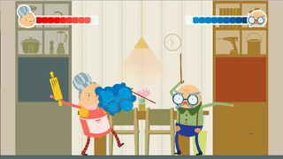

# Angry Grandparents



> The grandparents are angry and want to fight! Who will win the argument? Grab a friend, and fight it out in this hilarious one-on-one action game. 

##  Controls

The game can be played on a keyboard, or grab a controller and map the joysticks to the keys described!

### Grandma


```
A: Lean back & grab an object
D: Lean forward. Release to let go of object
W: Lift cane. Release to lower
```

### Grandpa

```
Right: Lean back & grab an object
Left: Lean forward. Release to let go of object
Up: Lift cane. Release to lower
```

## Download

[Download the release builds here.](https://github.com/angrygrandparents/kitchen/releases) MacOS, Windows 32-bit, and Windows 64-bit builds are available. 

## Running dev version

### Mac & Linux

```
./gradlew desktop:run
```

### Windows - untested

```
gradlew.bat desktop:run
```
